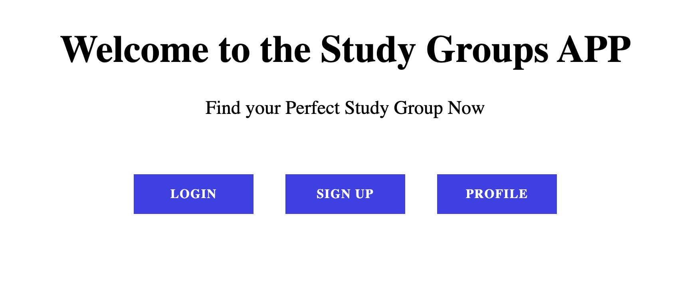
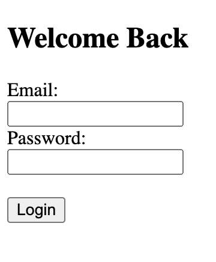
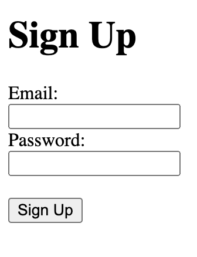
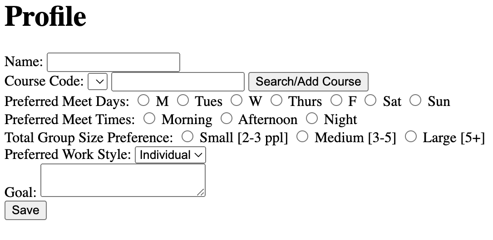
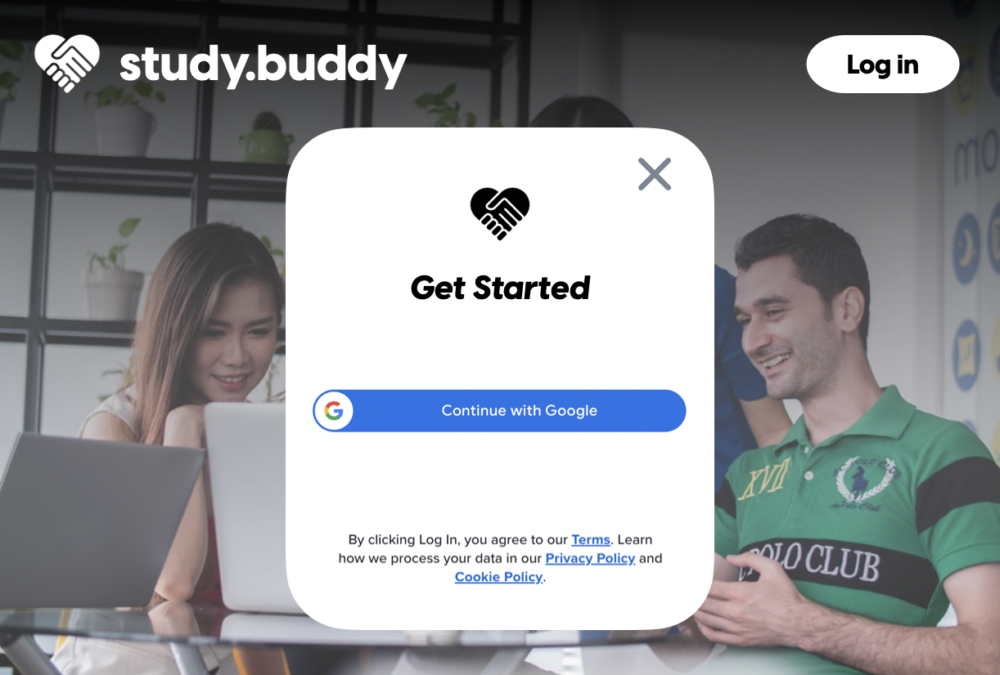

# termproject2023spring

# Study Group Finder

Study Group Finder is a Python Flask web application that allows users to sign up and create study groups for courses they are taking. It uses Flask's built-in authentication system and SQLite database to store user information and study group data.

# Installation

To run the application, you will need to have Python 3 and Flask installed. You can install Flask using pip:

Copy code
pip install flask
You will also need to have SQLite installed on your machine. SQLite comes pre-installed on many systems, but if it is not installed on your system, you can download it from the official SQLite website.

Once you have installed the required dependencies, you can clone the repository from GitHub:

bash
Copy code
git clone https://github.com/<your-username>/study-group-finder.git
Usage

To start the application, navigate to the study-group-finder directory and run the following command:

arduino
Copy code
flask run
This will start the application on http://localhost:5000/.

## Routes
The application has the following routes:

/ (homepage) - displays a list of users and courses  
/login - displays a login form and allows users to log in  
/signup - displays a signup form and allows users to create an account  
/profile - displays the user's profile information and allows them to create a study group for a course they are taking  
 
## Dependencies
Python 3  
Flask  
SQLite  

# Database Design

The application uses an SQLite database to store user information and study group data. The database has the following tables:

Users
user_id (primary key)
name
email
phone_number
password (encrypted)
Courses
course_id (primary key)
course_name
course_code
User_Courses
user_course_id (primary key)
user_id (foreign key referencing Users table)
course_id (foreign key referencing Courses table)
preferred_days
preferred_times
group_size_preference
work_style
goal

# Results  

 

show pics of the homepage, login page, signup page, and profile page, while explaining the flow of the site (for example, start with the homepage, then say you click the login button to get to the login page <show login page> then click login to get the profile page <show profile page>). explain how far we functionally got and got to test
  
# Project Evolution / Narrative    
Overall, the application provides a simple and user-friendly interface for creating and joining study groups for courses, and demonstrates the use of Flask's authentication system and SQLite database.  
  
## Expectations vs Reality  
photos of mockups, photo of homepage of actual site here; images didn't display, so for sake of time we kept the design basic

 
  
## Problems along the way  
user authentication (once logged in, you can't logout and sometimes it leads to an authentication error and doesn't allow you to access the profile) - when i run the code and click the login, sign up, or profile button on the profile, it takes me to a page that says "Unauthorized
The server could not verify that you are authorized to access the URL requested. You either supplied the wrong credentials (e.g. a bad password), or your browser doesn't understand how to supply the credentials required.". My hypothesis is that it is returning this error to me because I already logged in once. That is why I created a logout option in the app.py (although it doesn't show), and a profile button to just directly access the profile if I am already logged in. But I can't access the profile even if I click directly on the button on the homepage that should access it. How do I fix this? >>the solution we found: use this method "current_user.is_authenticated:" instead of looking if the user is logged in; this method is better because of xyz.  
  
search/add course button error where unless it is already in the database it gives you an error that says there is no method to add course; the solution to this was >>HAVE TO COME BACK TO THIS AFTER SOLVING. 
  
google api authentication to integrate google logins and sign ups; we thought it would be easiest to manage if people just signed in through their google accounts, but it ended up making the site not work, so we aborted the mission after finding many different keys to make it work; although with more time, we can see ourselves actually taking time to implement it.  
  
## Limitations of Project  
no logout button, don't have server so it doesnt keep user information after reloading, need enough people to make a match
   
## Frontend Roadmap
- [x] Set up a shared GitHub repository and invite the other team member.
- [x] Install necessary tools and libraries for Flask web development.
- [x] Design a basic user interface for the application, including the sign-up, login, and profile creation pages. You can use pen and paper or a simple wireframing tool.
- [x] Start implementing the frontend of the application using Flask and a templating engine like Jinja2. Focus on creating the main pages (sign-up, login, profile creation) with simple HTML forms and basic styling using CSS.
  
## Backend Roadmap
- [x] Research and choose a simple database management system (e.g., SQLite) for the project.
- [x] Install the chosen database and necessary libraries for connecting to the database from the Flask application.
- [x] Design a basic database schema with tables for user information and courses.
- [x] Set up the database in the development environment.
- [x] Create simple functions or classes to interact with the database (e.g., adding users, searching for courses).
- [x] Integrate the database with the frontend, so that user registration, login, and profile creation work with the backend.

# Credits

The Study Group Finder web application was created by Matthew Syrigos and Lily Ichise as a project for Problem Solving and Software Design.
